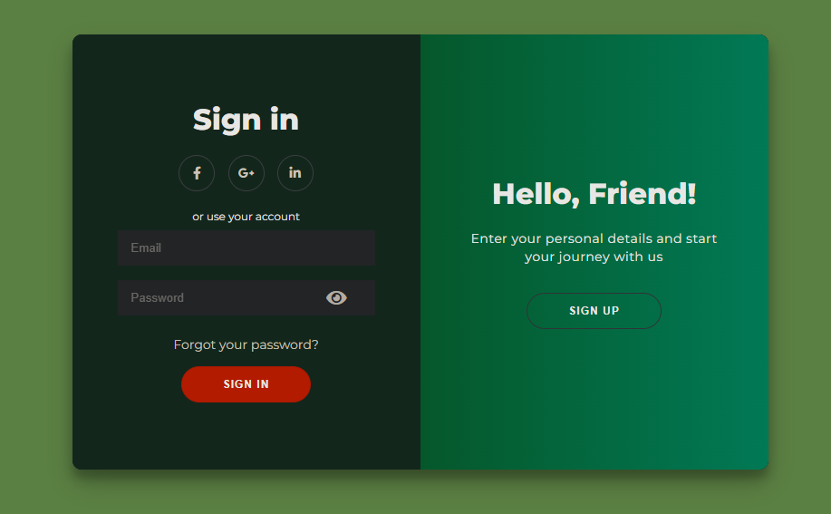

# [](https://git.io/typing-svg)


## Configurando CI

https://playwright.dev/docs/ci-intro#setting-up-github-actions


## 1. **Criar Repositório para o Projeto**

O primeiro passo é criar um repositório no GitHub para armazenar o código-fonte e a estrutura do projeto.

### Passos:
- Acesse o GitHub e crie um novo repositório.
- Dê um nome ao repositório (ex: `login-page`).
- Escolha a visibilidade (público ou privado).
- Selecione a opção para criar o repositório com um arquivo `README.md` (opcional).
- Crie o repositório e copie a URL para realizar o clone.

### Comando para clonar:
```bash
git clone https://github.com/seu-usuario/login-page.git
```

---

## 2. **Criar o Esboço da Página de Login**

A página de login é composta por dois formulários principais: **Cadastro** e **Login**. O esboço inicial da página pode ser feito com HTML básico e deve incluir:
- Inputs para email, senha, e nome (para cadastro).
- Links para redes sociais (Facebook, Google, LinkedIn).
- Botões de ação para "Sign Up" e "Sign In".
- Estilização simples para o layout da página.

### Exemplo de esboço:

<div align="center">
    
</div>

---

## 3. **Criar os Requisitos**

Os requisitos podem ser encontrados no link do Google Sheets fornecido: [Requisitos do Projeto](https://docs.google.com/spreadsheets/d/1sBozhmf2DiyuuFpKVSNXGExuf7cqiDg6zzc33_MyJ_4/edit?gid=0#gid=0).

- **Objetivo:** Certificar-se de que os requisitos do projeto estão claramente documentados para garantir que todas as funcionalidades da página sejam implementadas.
- **Ações:** Crie uma tabela com os requisitos funcionais, como:
  - Validação de campos (email e senha).
  - Login e cadastro com dados válidos/invalidos.
  - Exibição de mensagens de erro.
  - Funcionalidade de visualização de senha.

---

## 4. **Criar a Branch `html`**

Crie uma branch específica para o desenvolvimento da estrutura HTML da página.

### Passos:
```bash
git checkout -b html
```

Nessa branch, você vai realizar as modificações no arquivo HTML e submeter as mudanças para o repositório.

---

## 5. **Criar a Branch `css`**

Crie uma branch para a parte de estilização do projeto.

### Passos:
```bash
git checkout -b css
```

Essa branch será responsável pela criação do arquivo `styles.css` e adição de estilização à página de login.

---

## 6. **Criar a Branch `js`**

Crie uma branch para a implementação da lógica de JavaScript da página.

### Passos:
```bash
git checkout -b js
```

Nessa branch, você vai implementar as interações da página de login, como validação de campos, manipulação de erros, e exibição de mensagens.

---

## 7. **Criar a Branch do Framework**

Se o projeto utilizar algum framework, como **Bootstrap** ou **Tailwind CSS**, crie uma branch dedicada para a configuração e integração do framework.

### Passos:
```bash
git checkout -b framework
```

Esse framework será utilizado para melhorar a estrutura visual e responsiva da página.

---

## 8. **Instalação da Ferramenta de Testes**

Instale o **Cypress** (ou outra ferramenta de testes que você preferir) para automatizar os testes da página.

### Passos:
```bash
npm install cypress --save-dev
```

A instalação do Cypress permitirá rodar testes automatizados para garantir que as funcionalidades da página de login funcionem corretamente.

---

## 9. **Criar os Cenários de Teste**

Com base nos requisitos, crie os cenários de teste para validar as funcionalidades. Alguns exemplos de cenários podem ser:

- **Cenário 1:** Teste de Login com credenciais válidas.
- **Cenário 2:** Teste de Login com email inválido.
- **Cenário 3:** Teste de Login com senha incorreta.
- **Cenário 4:** Teste de Login com campos vazios.
- **Cenário 5:** Teste de Login com email e senha vazios.

### Exemplo de teste Playwright (Login com credenciais válidas):

```javascript
test('5 - Ambos Válidos', async () => {
    const browser = await webkit.launch();  // Lançar WebKit
    const page = await browser.newPage();   // Criar uma nova página
    await page.goto('https://horadoqa.github.io/login/');
    await expect(page).toHaveTitle(/Hora do QA/);

    // Preenche os campos do formulário
    await page.fill('#username', 'usuario@example.com');
    await page.fill('#password', '1q2w3e4r');
    
    // Clica no botão "Entrar"
    await page.click('button:has-text("Entrar")');
    
    // Clica no link do YouTube
    await page.click('a.youtube-button');
    
    // Verifica a URL do YouTube
    await expect(page).toHaveURL('https://www.youtube.com/@horadoqa');

    await browser.close();  // Fecha o navegador após o teste
});
```

---

## 11. **Deployar a Página no GitHub Pages**

Depois de validar que a página está funcionando corretamente, faça o deploy da página no GitHub Pages.

### Passos:
1. Crie a branch `gh-pages`:
   ```bash
   git checkout -b gh-pages
   ```
2. Faça o deploy com a ação `GitHub Pages` no fluxo de CI/CD.

---

## 12. **Criar os Testes Automatizados com Cypress**

Implemente testes automatizados no Cypress para validar funcionalidades como:

- **Validação de campos**.
- **Testes de login/cadastro**.
- **Erros ao enviar formulários incompletos**.
- **Mensagens de erro visíveis**.

Os testes serão executados de forma automática sempre que houver alterações no código.

---

## 13. **Validar os Resultados**

Após rodar os testes, valide se todos os cenários de teste passaram. Se algum teste falhar, faça ajustes no código até que todos os testes sejam bem-sucedidos.

---

## 14. **Criar o CI/CD**

Para automatizar o processo de deploy e testes, crie um arquivo de configuração do GitHub Actions (`.github/workflows/ci.yml`).

### Exemplo de configuração para CI/CD:

```yaml

```

---

## 15. **Preparar Apresentação do Projeto (1h)**

A apresentação do projeto deve incluir os seguintes tópicos:
- **Objetivo do Projeto**: Explicar o propósito da página de login.
- **Tecnologias Usadas**: Descrever as tecnologias utilizadas (HTML, CSS, JS, Cypress, GitHub Pages).
- **Testes Realizados**: Apresentar os testes criados e os cenários cobertos.
- **Demonstração**: Mostrar o funcionamento do sistema com base nos requisitos.
- **CI/CD**: Explicar o processo automatizado de testes e deploy com GitHub Actions.

--- 

